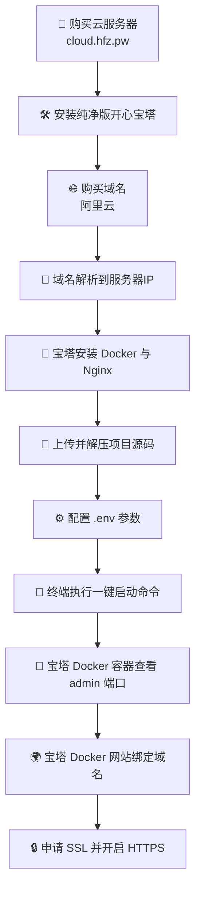

# Dujiaoka-Next 快速部署指南 <Badge type="tip" text="最新版" />

::: tip  核心流程概述
这份文档按照实际操作路径编写，专为快速部署设计：
**`购买服务器`** ➔ **`购买域名`** ➔ **`宝塔安装环境`** (Docker/Nginx) ➔ **`上传源码`** ➔ **`一键启动`** ➔ **`配置域名与 SSL`** 
:::

##  架构总流程图

<br>

::: details  点击展开详细流程图解（Mermaid）

:::

##  准备工作：服务器与域名

### 1. 购买服务器并安装宝塔

- 推荐在 **`cloud.hfz.pw`** 提供商处购买 Linux 云服务器（系统建议选择：`Ubuntu 22.04` <Badge type="warning" text="首选推荐" /> ）。
- 将系统初始化后，一键安装 **“纯净版开心宝塔”**。
- 登录宝塔面板后台，完成初始化的相关设置（账号、密码等基础安全步骤）。

### 2. 购买域名并解析

- 在 **[阿里云](https://www.aliyun.com/)** 或其他服务商处购买域名。
- 进入域名解析控制台，添加 `A` 记录，将其指向你的服务器公网 IP 地址。

::: info  推荐的解析记录设置
为了确保后续能够正常使用不同环境，建议至少准备以下记录：

| 主机记录 | 记录类型 | 记录值 (示例) | 说明 |
| --- | --- | --- | --- |
| `@` | A | `服务器 IP` | 根域名解析 |
| `www` | A | `服务器 IP` | WWW 域名辅助解析 |
| `admin` | A | `服务器 IP` | 后台管理专用域名 (可选) |
:::

##  环境配置：Docker 与 Nginx

进入**宝塔首页** -> **应用商店**，按照顺序完成以下基础服务的安装：

1. 安装 **Docker** 容器引擎。
2. 安装 **Nginx** Web 服务器。
3. 安装完成后，请务必确认 Docker 进程状态已稳定处于 **运行中**。

##  项目部署：获取与启动

### 1. 获取并解压源码

- 前往官方开源仓库下载最新版源码包：[Releases 下载页面](https://github.com/cnmbdb/Dujiaoka-Next-Docker/releases) <Badge type="info" text="GitHub" />。
- 在宝塔面板的 **“文件”** 页面，将压缩包直接上传至你的站点存放目录（例如 `/www/wwwroot/dujiaoka-next`）。
- 将压缩包当场解压倒该项目目录中。
- <Badge type="danger" text="必须操作" /> **修改权限**：按照项目运行要求，必须把项目根目录的所有者及读写权限统一修正为 `www / 777`。

### 2. 配置环境并一键启动

进入你的项目根目录，找到环境配置文件 `.env` 并根据实际情况进行修改。配置完成后，在宝塔文件管理页面顶部点击 **“终端”** 并执行以下命令：

::: code-group

```bash [启动服务]
docker compose pull
docker compose up -d
```

```bash [覆盖重启]
docker compose up -d --force-recreate
```
:::

::: warning  核心参数详解
`.env` 文件中包含各种重要的系统安全开关，其中 `HOST_BIND_IP` 极为关键：

- `HOST_BIND_IP=0.0.0.0`：允许外部通过 `http://服务器IP:端口` 直接访问（初始部署默认）。
- `HOST_BIND_IP=127.0.0.1`：仅允许服务器本地内部网络访问服务端口（**强烈推荐**在后续使用 Nginx 绑定域名并配置反代后开启）。

**注意事项：**
1. 如果你后续修改了 `HOST_BIND_IP` 等涉及 Docker 端口映射层面的配置，**必须执行 `覆盖重启` 命令**才能让更改生效。
2. 请注意检查 `.env` 文件中的 `API_URL`：如果当前值为本地地址 `http://127.0.0.1:3001`，那么正式绑定对外域名后，**务必将其更正为真正的公网 API 域名**（例如 `https://api.xxx.com`），否则浏览器加载时会向用户的回环地址发起请求导致无法访问。
3. 当 `HOST_BIND_IP=127.0.0.1` 开启时，宝塔界面中的“点击端口直接打开”功能会自动失效，这是**正常现象**；后续你必须直接使用配置好的域名去进行正常的反向代理访问。
:::


##  二次验证与发布

### 1. 访问验证后台

进入宝塔界面的 **首页 -> Docker -> 容器**，找到名称中包含 `admin` 关键词的容器。查看其最终对外开放的端口。

::: info  默认登录信息参考
使用 `服务器IP:开放端口` 即可打开管理界面。

- **快速登录入口**：`http://服务器IP:3002/login`
- **默认管理员账号**：`admin`
- **默认管理员密码**：`admin123`
:::

### 2. 绑定域名与 HTTPS 加密防护

这是非常重要的一步，为网站套上安全加密：

1. 按照宝塔标准路径进入：**首页** -> **Docker** -> **网站**
2. 点击 **“添加网站”** 绑定你提前解析好的用户端访问域名及后台独立域名。
3. 接着进入该网站设置的 **“SSL”** 管理页签开始申请机构证书（宝塔已支持通过 Let's Encrypt 一键便捷申请免费版）。
4. 勾选并确保开启 **强制 HTTPS** 开关。
5. 返回进入项目根目录的 `.env` 文件内部，将 `HOST_BIND_IP` 的值设置为 `127.0.0.1` 以封堵端口直连机制，防止被越过加密防护直接被公网未授权探测：
   ```bash
   HOST_BIND_IP=127.0.0.1
   docker compose up -d --force-recreate
   ```

---

##  常用运维指令宝典

在未来的日常系统维护升级或是突发排查中，这些组合命令可以大大提升管理效率（请在 **项目目录终端内** 依次执行哦）：

::: code-group

```bash [日常更新版本]
# 从远程镜像拉取最新层代码并平滑重建相关容器
docker compose pull
docker compose up -d
```

```bash [强制覆写重建]
# 适用情况：修改了端口映射、换上了其他镜像标签或更改了容器层启动参数
docker compose up -d --force-recreate
```

```bash [运行状态监控]
# 粗略查看当前所有已被关联容器的运转状态存活情况
docker compose ps
```

```bash [完整日志排查]
# 实时连贯追踪打印所有关联容器的标准输出与错误日志 (-f 实时监控)
docker compose logs -f
```

:::

::: tip  架构特征
当前项目的所有微服务节点（包含核心件与 `appstore-expand` 拓展端）完全依托于**远程分发镜像**完成轻量部署交付。系统运行层面的各项定制配置完全收束于一份独立的挂载型 `.env` 环境变量配置文件内，极其方便运维人员做高频灵活按需干预。
:::
