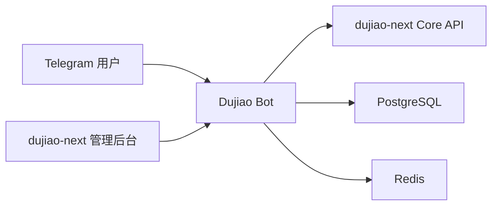

# 发卡机器人 <Badge type="tip" text="Dujiao Bot" />

Dujiao Bot 是为 dujiao-next 设计的 Telegram 业务插件。用户可以直接在 Telegram 中浏览商城入口、查询订单、接收付款与发货通知，并发起客服会话；管理员则可以在 dujiao-next 后台统一配置机器人菜单、命令、关键词回复和通知行为。

::: tip 适用场景
适合销售卡密、兑换码、软件授权、会员服务等数字商品。插件服务与商城核心服务相互独立，启用、停用或更新机器人时不会修改 dujiao-next 的核心容器。
:::

## 功能概览

| 功能 | 说明 |
| --- | --- |
| 自动发货 | 支付成功后处理发货队列，并向已绑定 Telegram 的用户推送交付内容。 |
| 订单查询 | 用户可通过 `/orders` 查看最近订单，通过 `/track 订单号` 查询指定订单。 |
| 状态通知 | 支持新订单、付款、发货、退款及低库存等业务通知。 |
| 客服会话 | 用户发送 `/support` 创建客服会话，管理员可继续处理或结束会话。 |
| 自定义菜单 | 可配置商城、商品、邀请、赠品、Mini App 和客服等入口。 |
| 多语言 | 内置简体中文、繁体中文和英文菜单文案。 |

机器人常用命令如下：

| 命令 | 用途 |
| --- | --- |
| `/start` | 选择语言并打开主菜单。 |
| `/menu` | 重新打开主菜单。 |
| `/help` | 查看机器人帮助。 |
| `/orders` | 查看当前用户的订单。 |
| `/track 订单号` | 查询指定订单的状态。 |
| `/support` | 创建客服会话。 |

## 界面展示

<div class="dujiao-bot-gallery">
  <figure>
    <a href="/images/dujiao-bot/bot-settings.webp" target="_blank" rel="noopener noreferrer">
      
    </a>
    <figcaption>机器人设置</figcaption>
  </figure>
  <figure>
    <a href="/images/dujiao-bot/telegram-client.webp" target="_blank" rel="noopener noreferrer">
      
    </a>
    <figcaption>Telegram 用户端</figcaption>
  </figure>
  <figure>
    <a href="/images/dujiao-bot/plugin-management.webp" target="_blank" rel="noopener noreferrer">
      
    </a>
    <figcaption>扩展插件管理</figcaption>
  </figure>
  <figure>
    <a href="/images/dujiao-bot/groups-users.webp" target="_blank" rel="noopener noreferrer">
      
    </a>
    <figcaption>群组与用户</figcaption>
  </figure>
</div>

## 运行关系



Dujiao Bot 默认监听容器内的 `3020` 端口，并加入 `dujiao-network` 网络。插件依赖以下 dujiao-next 核心服务：

- PostgreSQL：保存绑定关系、发货队列、客服会话和插件配置。
- Redis：保存缓存与运行状态。
- Core API：读取商城用户、商品和订单数据。

## 1. 准备 Telegram 机器人

1. 在 Telegram 中打开官方 [@BotFather](https://t.me/BotFather)。
2. 发送 `/newbot`，依次设置机器人显示名称和用户名。机器人用户名必须以 `bot` 结尾。
3. 保存 BotFather 返回的 **Bot Token**。该 Token 等同于机器人密码，不要发送给他人或提交到 Git。
4. 准备管理员的 Telegram 数字 ID。多个管理员 ID 使用英文逗号分隔，不要填写 `@用户名`。
5. 在正式启用前，先从自己的 Telegram 账号给新机器人发送一条消息或点击 **Start**。

::: warning Token 泄露处理
如果 Bot Token 曾出现在公开聊天、截图或代码仓库中，请立即在 BotFather 中使用 `/revoke` 重新生成 Token，再更新插件配置。
:::

## 2. 安装并启用插件

### 方式一：从应用扩展商店启用 <Badge type="tip" text="推荐" />

1. 确认已完成[应用扩展商店安装](/guide/app-store-installation)。
2. 登录 dujiao-next 管理后台，进入 **插件商店**。
3. 找到 **Dujiao Bot**，完成安装后点击 **启用**。
4. 等待插件状态显示为运行中，并确认健康检查通过。
5. 打开插件管理页面中的 **Dujiao Bot** 后台入口，继续填写机器人配置。

应用商店会读取插件的 `plugin.json`，自动注册容器服务、后台入口、静态资源和生命周期脚本。插件目录应位于：

```text
/www/wwwroot/项目文件名称/plugins/dujiao-bot/
```

### 方式二：通过终端手动启用

如果当前版本暂时无法从应用商店操作，可以在 dujiao-next 项目根目录执行：

```bash
cd /www/wwwroot/项目文件名称
cp plugins/dujiao-bot/.env.example plugins/dujiao-bot/.env
chmod +x plugins/dujiao-bot/hooks/*.sh
```

编辑 `plugins/dujiao-bot/.env` 并保存后，再执行安装和启用脚本：

```bash
./plugins/dujiao-bot/hooks/install.sh
./plugins/dujiao-bot/hooks/enable.sh
```

::: warning 数据库配置必须一致
插件 `.env` 中的 `DB_NAME`、`DB_USER`、`DB_PASSWORD`、Redis 密码必须与 dujiao-next 主项目的实际配置一致。不要直接保留 `change-me` 等示例值。
:::

## 3. 配置机器人

插件启用后，在 dujiao-next 后台打开 **Dujiao Bot → 机器人设置**。至少填写以下配置：

| 配置项 | 示例 | 说明 |
| --- | --- | --- |
| Bot Token | `123456:ABC...` | BotFather 创建机器人后返回的 Token。 |
| Bot 用户名 | `example_shop_bot` | 不包含 `@` 的机器人用户名。 |
| 管理员 ID | `123456789,987654321` | Telegram 数字 ID，多个值用英文逗号分隔。 |
| 商城地址 | `https://shop.example.com` | 用户点击商品、订单等按钮时访问的 dujiao-next 前台地址。 |
| Core API | `http://dujiao-next-api:3000` | Docker 内部访问 dujiao-next API 的地址。通常保持默认值。 |
| 客服链接 | `https://t.me/example_support` | 可选，显示在客服会话中的人工服务入口。 |
| Webhook 地址 | `https://shop.example.com/plugins/dujiao-bot/webhook/telegram` | 可选；留空时机器人使用长轮询。 |

填写完成后点击 **保存设置**，再点击 **重启并 webhook**，使新配置载入运行中的容器。后台保存的运行配置位于插件持久卷 `/plugin/data/.env`，重建容器后仍会保留。

### 手动编辑 `.env`

通过终端部署时，可参考以下最小配置。请将占位内容替换为实际值：

```env
TELEGRAM_BOT_TOKEN=你的_Bot_Token
TELEGRAM_BOT_USERNAME=example_shop_bot
TELEGRAM_ADMIN_IDS=123456789
TELEGRAM_SHOP_URL=https://shop.example.com

API_BASE_URL=http://dujiao-next-api:3000
API_INTERNAL_URL=http://dujiao-next-api:3000

ENABLE_AUTO_DELIVERY=true
ENABLE_CUSTOMER_SERVICE=true
ENABLE_NOTIFICATION=true
ENABLE_ORDER_TRACKING=true
ENABLE_BROADCAST=true
AUTO_DELIVERY_ENABLED=true
CUSTOMER_SERVICE_ENABLED=true
```

生产环境还应把 `JWT_SECRET`、`SESSION_SECRET` 和数据库密码改为独立的强随机值。

### Polling 与 Webhook 如何选择

- **Polling（默认）**：`TELEGRAM_WEBHOOK_URL` 留空即可，适合快速部署和排查问题，不要求额外开放公网回调地址。
- **Webhook**：适合已配置域名和 HTTPS 的生产环境。回调地址必须能从公网通过 HTTPS 访问，例如 `https://shop.example.com/plugins/dujiao-bot/webhook/telegram`。

::: info 切换连接方式
保存或修改 `TELEGRAM_WEBHOOK_URL` 后必须重启 Dujiao Bot。配置了地址时会自动注册 Webhook；留空时会自动使用 Polling。
:::

## 4. 完成功能配置

机器人连接成功后，可继续在插件后台设置：

- **功能链配置**：组合命令触发条件和回复动作。
- **命令设置**：管理斜杠命令、权限和显示顺序。
- **键盘按钮**：配置主菜单中的固定入口。
- **内联按钮**：配置消息下方的商品、订单或活动按钮。
- **关键词回复**：设置常见问题和自动回复内容。
- **群组与用户**：查看机器人用户及群组数据。

建议先完成商城地址和用户绑定流程，再开启自动发货。这样可以避免付款成功后，因为 Telegram 用户尚未绑定而无法发送交付内容。

## 5. 验证运行状态

在 dujiao-next 项目根目录执行：

```bash
docker ps --filter name=dujiao-bot
docker logs --tail 100 dujiao-bot
docker exec dujiao-bot node -e "require('http').get('http://127.0.0.1:3020/health',r=>{console.log(r.statusCode);process.exit(r.statusCode===200?0:1)}).on('error',()=>process.exit(1))"
```

健康检查返回 `200` 后，依次进行以下业务测试：

1. 给机器人发送 `/start`，确认语言选择和主菜单正常显示。
2. 完成 Telegram 用户与商城账户绑定。
3. 发送 `/orders` 和 `/track 订单号`，确认可以读取订单。
4. 创建一笔测试订单并完成付款，确认通知和自动发货内容送达。
5. 发送 `/support`，确认客服会话可以创建和结束。

::: warning 健康不等于业务可用
容器健康检查只说明 HTTP 服务已经启动。仍需验证 Telegram 连接、数据库、Redis、Core API、用户绑定和实际发货流程。
:::

## 常见问题

### 机器人没有回复

先检查 `TELEGRAM_BOT_TOKEN` 和用户名是否正确，再查看容器日志。如果日志中出现 Telegram 连接错误，请确认服务器可以访问 `api.telegram.org`。使用 Webhook 时，还要确认域名证书有效且回调地址可从公网访问。

### 保存配置后仍使用旧值

保存设置后点击 **重启并 webhook**，或执行：

```bash
docker restart dujiao-bot
```

### 无法查询订单

确认用户已经完成 Telegram 绑定，并检查 `API_INTERNAL_URL` 是否为容器网络内可访问的 Core API 地址。默认值为 `http://dujiao-next-api:3000`。

### 数据库或 Redis 连接失败

确认 dujiao-next 核心容器已经启动、`dujiao-network` 网络存在，并核对插件 `.env` 与主项目中的数据库名称、用户名、密码及 Redis 密码。

### Webhook 与 Polling 冲突

同一个 Bot Token 只能稳定使用一种更新接收方式。需要切回 Polling 时，清空 `TELEGRAM_WEBHOOK_URL`，保存后重启插件。

## 停用与卸载

手动停用插件：

```bash
./plugins/dujiao-bot/hooks/disable.sh
```

停用只会停止服务，不会删除数据。卸载脚本默认同样保留插件的 `data` 和 `logs` 持久卷；只有明确设置 `PLUGIN_REMOVE_DATA=1` 时才会删除数据卷。执行删除数据的卸载操作前，请先备份配置、绑定关系和业务数据。

## 安全建议

- 不要把 Bot Token、数据库密码、`JWT_SECRET` 或 `SESSION_SECRET` 提交到 Git。
- 管理员列表只填写可信账号的 Telegram 数字 ID。
- Webhook 必须使用有效的 HTTPS 证书，只对公网开放必要的代理路由。
- PostgreSQL 和 Redis 应保留在 Docker 内部网络，不要直接暴露到公网。
- 定期检查发货失败日志和低库存通知，升级插件前备份持久数据。

## 参考资料

- [Dujiao-Bot：Dujiao-Next Telegram 自动发货机器人插件完整指南](https://hfz.pw/archives/2482)
- [Telegram BotFather](https://t.me/BotFather)
